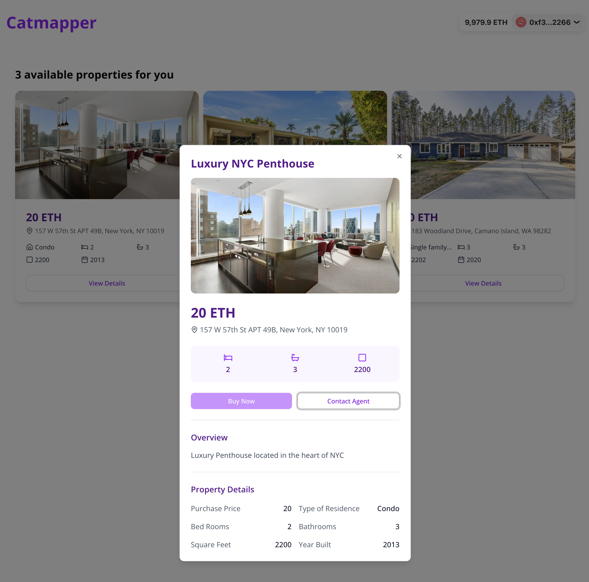

# 🏠 CatMapper - Real Estate NFT Marketplace

A decentralized real estate marketplace built on Ethereum blockchain that allows users to tokenize, buy, sell, and trade real estate properties as NFTs with integrated escrow functionality.

Now deployed at https://catmapper.vercel.app/ pointing to Sepolia 👀



### Key Features

- **NFT Property Tokenization**: Convert real estate properties into tradeable NFTs using ERC721 standard
- **Escrow Services**: Secure transaction handling with multi-party approval system (buyer, seller, inspector, lender)
- **Decentralized Marketplace**: Peer-to-peer property trading without intermediaries
- **Modern Web Interface**: Responsive design with property cards and detailed property dialogs
- **Smart Contract Integration**: Automated and transparent transaction processing
- **Property Metadata**: Rich property information including location, price, bedrooms, bathrooms, and more

## 🛠 Technology Stack

### Frontend

- **Next.js** - React framework with App Router
- **TypeScript** - Type-safe development
- **Tailwind CSS** - Latest utility-first CSS framework
- **RainbowKit** - Wallet connection UI
- **Wagmi** - React hooks for Ethereum
- **Viem** - TypeScript interface for Ethereum
- **Radix UI** - Accessible UI components (Dialog, Separator, Slot)
- **Lucide React** - Icon library

### Blockchain & Smart Contracts

- **Solidity** - Smart contract development
- **Hardhat** - Ethereum development environment
- **OpenZeppelin** - Secure smart contract libraries
- **Ethers.js** - Ethereum library for JavaScript

### Development Tools

- **ESLint** - Code linting
- **Turbopack** - Fast bundler for development
- **Testing Library** - Contract testing

## 📁 Project Structure

```
catmapper/
├── src/
│   ├── app/                  # Next.js App Router
│   │   ├── layout.tsx         # Root layout
│   │   ├── page.tsx           # Home page with property listings
│   │   └── globals.css        # Global styles
│   ├── components/            # React components
│   │   ├── listing/           # Property listing components
│   │   │   ├── ListingCard.tsx
│   │   │   ├── ListingCardSkeleton.tsx
│   │   │   ├── ListingDialog.tsx
│   │   │   └── ListingAttributes.tsx
│   │   ├── shared/            # Shared components
│   │   │   └── navigation/
│   │   │       └── NavigationBar.tsx
│   │   ├── ui/                # UI components
│   │   │   ├── button.tsx
│   │   │   ├── card.tsx
│   │   │   ├── dialog.tsx
│   │   │   ├── badge.tsx
│   │   │   └── separator.tsx
│   │   └── providers.tsx      # App providers
│   ├── contracts/             # Smart contracts
│   │   ├── RealEstate.sol     # ERC721 NFT contract
│   │   ├── Escrow.sol         # Escrow contract
│   │   └── __tests__/         # Contract tests
│   ├── hooks/                 # Custom React hooks
│   │   ├── useGetProperties.tsx
│   │   ├── useGetPropertyState.tsx
│   │   ├── useGetStakeholders.tsx
│   │   └── useGetTotalSupply.tsx
│   ├── config/                # Configuration files
│   │   └── wagmi.ts           # Wagmi configuration
│   ├── consts/                # Constants and configurations
│   │   ├── abis/              # Contract ABIs
│   │   ├── config.json        # Contract addresses
│   │   ├── listing.ts         # Listing constants
│   │   └── metadata/          # Property metadata
│   ├── types/                 # TypeScript type definitions
│   │   ├── global.d.ts
│   │   └── listing.d.ts
│   ├── lib/                   # Utility libraries
│   │   └── utils.ts
│   └── scripts/               # Deployment scripts
│       └── deploy.js
├── public/                    # Static assets
│   ├── logo.svg
│   └── other assets...
```

## 🚀 Getting Started

### Prerequisites

- Node.js (v18 or higher)
- npm, yarn, pnpm, or bun
- MetaMask or another Web3 wallet
- Access to an Ethereum network (mainnet, testnet, or local Hardhat network)

### Installation

1. **Clone the repository**

   ```bash
   git clone <repository-url>
   cd catmapper
   ```

2. **Install dependencies**

   ```bash
   npm install
   # or
   yarn install
   # or
   pnpm install
   # or
   bun install
   ```

3. **Set up environment variables**

   Create a `.env.local` file with:

   ```bash
   NEXT_PUBLIC_REOWN_PROJECT_ID=your_project_id_here
   ```

4. **Compile smart contracts**

   ```bash
   npx hardhat compile
   ```

5. **Run hardhat local node**

   ```bash
   npx hardhat node
   ```

6. **Deploy contracts (optional)**
   ```bash
   npx hardhat run scripts/deploy.js --network localhost
   ```

### Development

Start the development server:

```bash
npm run dev
# or
yarn dev
# or
pnpm dev
# or
bun dev
```

Open [http://localhost:3000](http://localhost:3000) with your browser to see the result.

### Available Scripts

- `npm run dev` - Start development server with Turbopack
- `npm run build` - Build for production
- `npm run start` - Start production server
- `npm run lint` - Run ESLint
- `npm run test:contracts` - Run smart contract tests

## 🏗 Smart Contracts

### RealEstate Contract

- **ERC721 NFT Contract**: Manages property tokenization
- **Minting**: Allows users to mint new property NFTs
- **Metadata**: Supports token URI for rich property data
- **Total Supply**: Tracks total number of properties

### Escrow Contract

- **Multi-party Approval**: Requires approval from buyer, seller, inspector, and lender
- **Property Listing**: Sellers can list properties with purchase price and escrow amount
- **Inspection Process**: Inspector can approve/reject property inspection
- **Secure Transactions**: Funds held in escrow until all approvals are met
- **Finalization**: Automated property transfer and payment distribution
